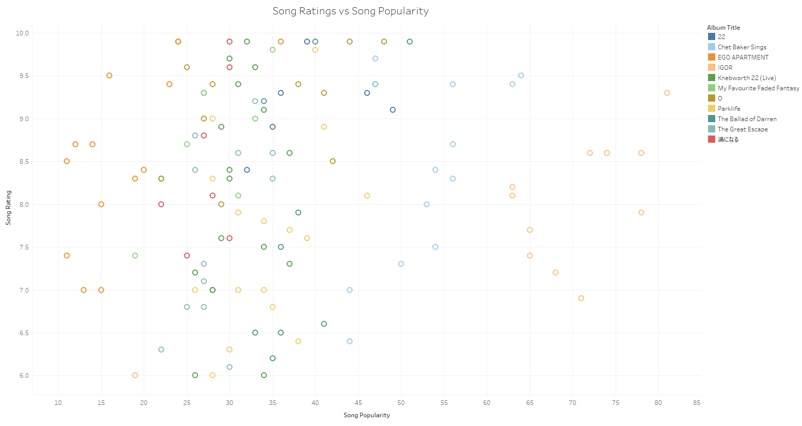
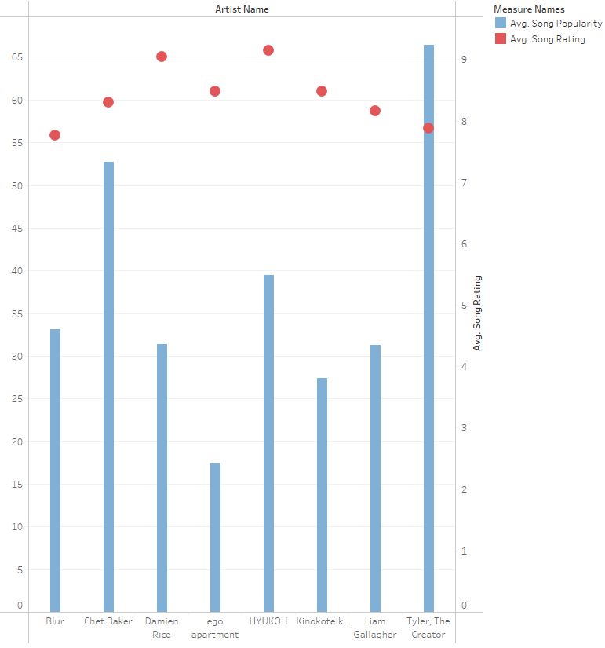
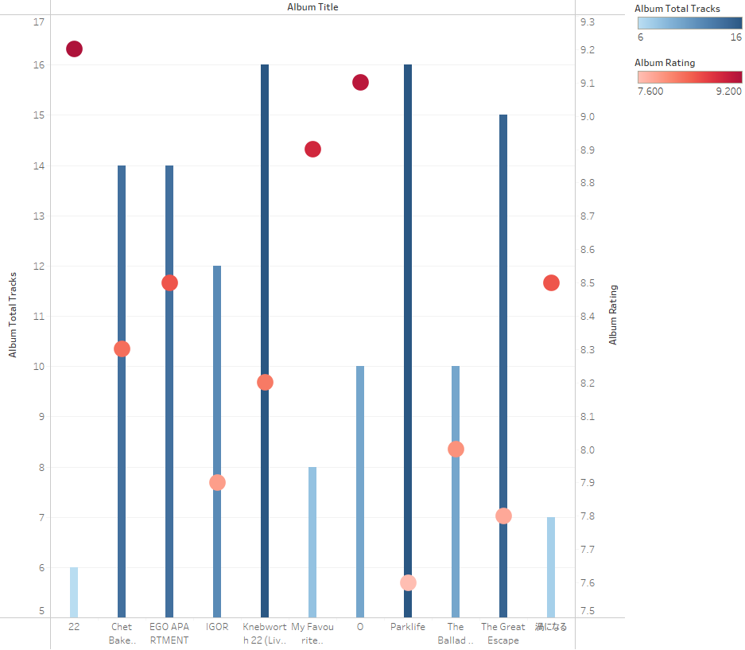

# Spotify Playlist Import and Analysis Project

## Overview
This project is designed to import Spotify playlists into a MySQL database using the Spotify API. Once the data is imported, users can input their own song ratings. Additionally, the project includes R scripts for analyzing the data using various tools in R.

## Project Structure
- `main_project/`: Contains the main project files for importing Spotify playlists to MySQL.
- `r_analysis/`: Contains R scripts for analyzing the imported data.

## Setup and Usage
### Main Project
1. Install the required Python packages:
    ```bash
    pip install spotipy mysql-connector-python
    ```
2. Update the credentials in `import_spotify.py`:
    - `client_id` and `client_secret` for Spotify API.
    - MySQL connection details.

3. Create the necessary tables in MySQL using `create_tables.sql` and `Triggers.sql`.

4. Run the `import_spotify.py` script to import a Spotify playlist into the database.

### R Analysis
1. Ensure you have R installed on your system along with the required packages.
2. Update any necessary connection details in the R scripts.
3. Run the `shiny.r` script to launch the Shiny app for data analysis.
4. Use `plots.r` to generate various plots based on the data.

**For detailed instructions on each part, refer to the README files in the respective subfolders.**

### Tableau Graphs With My Own Data ([Check main_project for .csv files](./main_project))

<div align="center">
  
  <p>Graph of Song Ratings vs. Song Popularity for my Top 11 Albums </p>

  
  <p>Graph Comparing Average Song Popularities and Song Ratings for My Favourite Artists </p>

  
  <p>Graph Comparing Number of Tracks and Album Ratings for My Favourite Albums</p>
</div>

