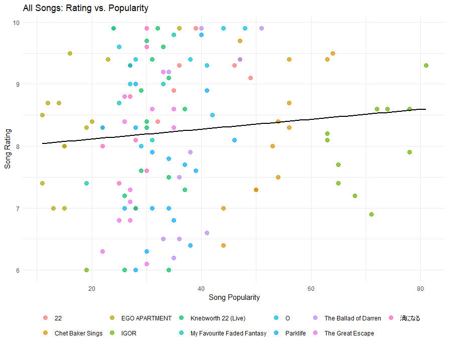
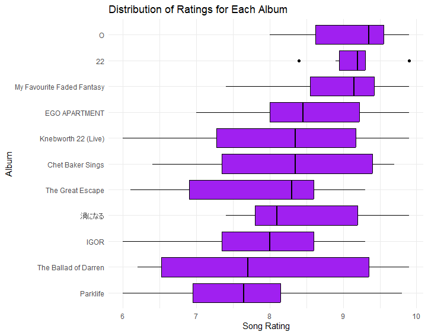
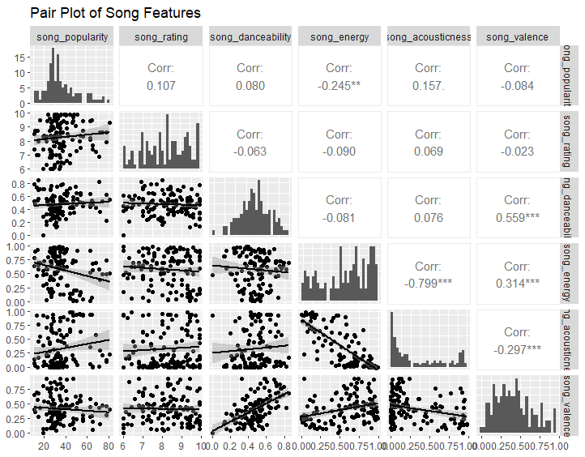

# R Analysis: Spotify Data

## Overview
This part of the project contains R scripts for analyzing the Spotify playlist data imported into MySQL. The main feature is a Shiny app that allows users to interactively explore their data. Additionally, static plots are provided as examples of visualizations users can create.

## Project Structure
- `shiny.r`: R script for the Shiny app to analyze data.
- `plots.r`: R script for generating static plots based on the data.

## Setup and Usage
### Prerequisites
- R (version 4.0 or later)
- R packages: `shiny`, `DBI`, `RMySQL`, `ggplot2`, `dplyr`, `tidyr`

### Installation
1. **Install R Packages:**
   Install the required R packages:
    ```r
    install.packages(c("shiny", "DBI", "RMySQL", "ggplot2", "dplyr", "tidyr"))
    ```

### Running the Shiny App
1. **Update Database Connection Details:**
   - Open the `shiny.r` script.
   - Update the database connection details with your MySQL database credentials.

2. **Run the Shiny App:**
    ```r
    shiny::runApp("shiny.r")
    ```

### Generating Static Plots
1. **Update Database Connection Details:**
   - Open the `plots.r` script.
   - Update the database connection details with your MySQL database credentials.

2. **Generate Plots:**
   Modify plots.r with personal code to generate plots that fit your needs.
    
    ```r
    source("plots.r")
    ```


### R Graphs With My Own Data (Check main_project for [.csv files](./main_project/examples))

<div align="center">
  
  <p>Graph of Song Ratings vs Popularity</p>

  
  <p>Distributions of Ratings for Each of My Favourite Albums</p>

  
  <p>Pair Plot for Song Features</p>
</div>

## Acknowledgements
- This project uses the [Shiny library](https://shiny.rstudio.com/) for building the interactive web application.
